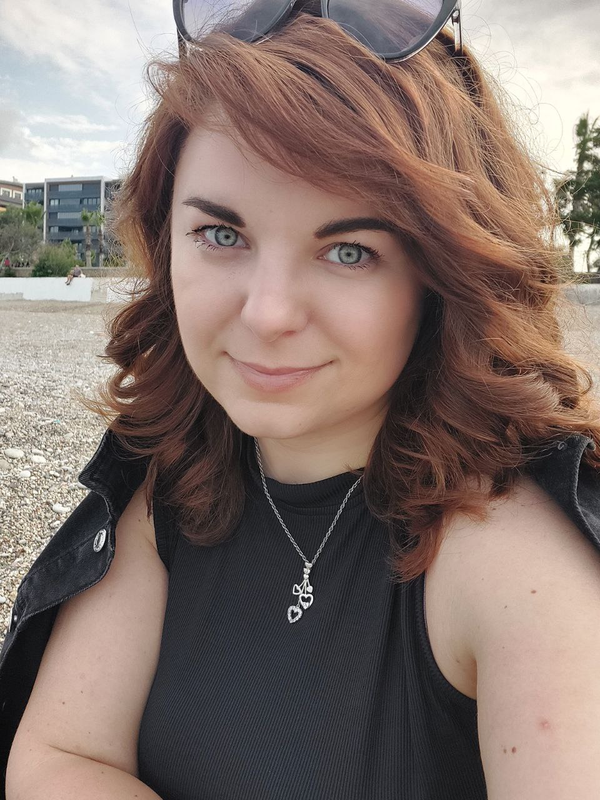

# Hello! Welcome to my portfolio!

## My name is Viktoria. I'm 31 years old and live in the most beautiful place in the world - Antalya, Turkey.

I am a junior QA engineer and just at the beginning of my new career path.

**What I already know:**

1. I have knowledge of testing theory and key test design techniques.
2. Test cases, checklists, and test suites.
3. Types of bugs and creating bug reports in Jira.
4. Basics of client-server interaction and working with APIs.
5. Software development methodologies.
6. I know HTML and am currently studying JavaScript, Java, and Python.

**Tools:** Jira, Git, Postman, DevTools, Figma.
**Languages:** Russian and Ukrainian - native, English - B2, Turkish - B1.

I would be happy to keep learning, be useful for your team and grow together!

**My contacts:**
Tel: +905411102078
Email: [vikavasilenko2013@gmail.com](vikavasilenko2013@gmail.com)